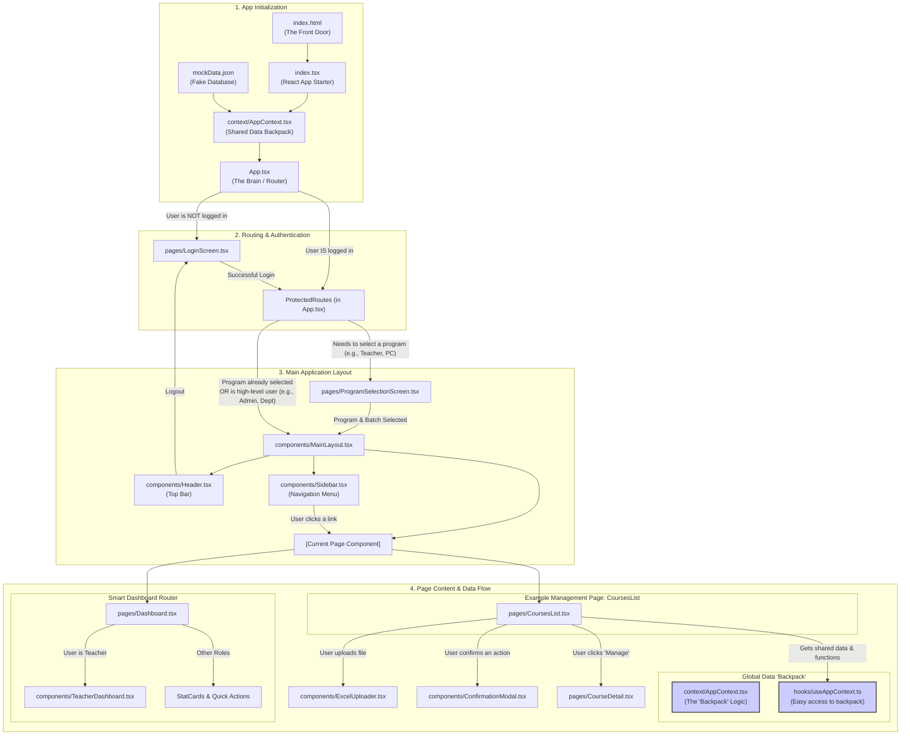

# NBA Outcome Based Education (OBE) Portal

  

A comprehensive web application designed for educational institutions to manage, track, and calculate learning outcomes in accordance with the National Board of Accreditation (NBA) guidelines.

---

## Table of Contents

-   [Introduction](#introduction)
-   [Problem Statement](#problem-statement)
-   [Key Features](#key-features)
-   [Technology Stack](#technology-stack)
-   [Application Architecture](#application-architecture)
-   [User Roles & Permissions](#user-roles--permissions)
-   [Core Workflows](#core-workflows)
-   [Getting Started (Development)](#getting-started-development)
-   [Backend Integration](#backend-integration)

## Introduction

The **NBA Outcome Based Education (OBE) Portal** serves as a centralized platform for faculty and administrators to manage curriculum data, record student performance, and automate the complex process of calculating Course Outcome (CO) and Program Outcome (PO) attainment.

Our vision is to be the definitive digital tool for educational institutions to seamlessly implement and manage Outcome Based Education, transforming the accreditation process from a burdensome chore into a continuous quality improvement cycle.

## Problem Statement

For most institutions, the process of managing OBE is manual, relying on a labyrinth of spreadsheets. This approach is:
-   **Time-Consuming:** Faculty spend countless hours on data entry and repetitive calculations.
-   **Error-Prone:** Manual data handling is susceptible to human error.
-   **Opaque:** It's difficult to get a clear, real-time overview of curriculum effectiveness.
-   **Inefficient for Reporting:** Compiling reports for NBA audits is a monumental task.

The NBA OBE Portal solves these problems by providing a single, streamlined, and automated solution.

## Key Features

-   **Automated Attainment Calculation:** Eliminates manual spreadsheets for CO and PO attainment.
-   **Centralized Data Management:** A single source of truth for curriculum, faculty, students, and assessments.
-   **Role-Based Access Control:** A secure system where each user only sees what's relevant to their role.
-   **Streamlined Workflows:** Easy-to-use interfaces for managing courses, defining outcomes, and uploading marks via Excel.
-   **Dynamic Reporting:** Generate, preview, and download professional, print-ready PDF reports for accreditation and review.
-   **Full Academic Hierarchy Management:** Tools for Admins and Department Heads to define and manage colleges, programs, batches, and sections.

## Technology Stack

-   **Framework:** React 18
-   **Language:** TypeScript
-   **Styling:** TailwindCSS
-   **Routing:** React Router v6
-   **Data/Excel Parsing:** SheetJS (xlsx)
-   **PDF Generation:** jsPDF & html2canvas

## Application Architecture

The application is a client-side React single-page application (SPA).

-   **State Management:** It uses React's Context API (`AppContext`) as a centralized "magic backpack" to manage global state, such as the logged-in user, selected program/batch, and the entire application's mock dataset. A custom hook `useAppContext` provides easy access to this context.
-   **Routing:** `React Router` is used for all client-side navigation, protecting routes from unauthenticated access and directing users to the appropriate views based on their role and session state.
-   **Data Flow:** In its current state, the application loads all data from a local `mockData.json` file on startup. All data manipulations are performed client-side by updating the state within the `AppContext`.

## User Roles & Permissions

The portal supports a hierarchical permission system to ensure data security and relevance for each user.

| Role | Primary Responsibilities |
| :--- | :--- |
| **Administrator** | Manages the entire system's academic structure (colleges, programs), user accounts, and system-wide settings. |
| **University** | A high-level, read-only role to view data across all colleges and programs. |
| **Department Head** | Manages a college/department, including faculty assignments and student section management. |
| **Program Co-ordinator** | Manages a specific program's curriculum: courses, COs, POs, and teacher assignments. |
| **Teacher** | Manages their assigned courses: assessments, question mapping, and student grading. |

A detailed breakdown of permissions can be found in the project's documentation.

## Core Workflows

### Teacher Workflow
1.  **Access Course:** Log in, select a program/batch, and choose a course from the Teacher Dashboard.
2.  **Manage COs:** Navigate to the "COs" tab to define the course's learning outcomes.
3.  **Create Assessments:** Go to the "Assessments" tab, select a section, and create a new assessment (e.g., "Mid-Term Exam").
4.  **Manage Questions:** Add questions to the assessment and map them to the relevant COs.
5.  **Grade Students:** Download the Excel marks template, fill it in, and upload it back to the portal.
6.  **View Attainment:** The system automatically calculates attainment, which can be viewed in the "CO Attainments" tab or in formal reports.

### Program Co-ordinator Workflow
-   Perform all Teacher tasks.
-   **Manage Courses:** Create new courses for the program and manage their lifecycle (Future -> Active -> Completed).
-   **Manage POs:** Define the high-level Program Outcomes for the curriculum.
-   **Map COs to POs:** Use the mapping matrix to define the relationship between course-level and program-level outcomes.
-   **Assign Faculty:** Assign teachers to courses or specific sections.

### Admin Workflow
-   **Build Academic Structure:** Define the university's hierarchy by creating Colleges, Programs, and Batches.
-   **Manage Users:** Create, edit, and delete all user accounts and assign them to roles and departments.
-   **Configure System:** Set system-wide default values for calculations.

## Getting Started (Development)

This project is a zero-installation, static web application. No build step is required.

1.  Clone the repository or download the source files.
2.  Open the `index.html` file in your web browser.

The application will run using the data provided in `mockData.json`.

## Backend Integration

The current version of the portal operates entirely on the client-side using a mock data file. A complete guide for building a corresponding backend server is provided in the repository.

-   **Backend Guide:** See `backend_guide.md` for a comprehensive, step-by-step tutorial on building the API using Django REST Framework, PostgreSQL, and Docker.
-   **Database Schema:** The required PostgreSQL schema is available in `schema.sql.txt`.
-   **Seed Data:** An SQL script to populate the database with the initial mock data is available in `data_insertion.sql.txt`.

The frontend is designed to be easily refactored to consume this live API, replacing all client-side `setData` calls with RESTful API requests.
